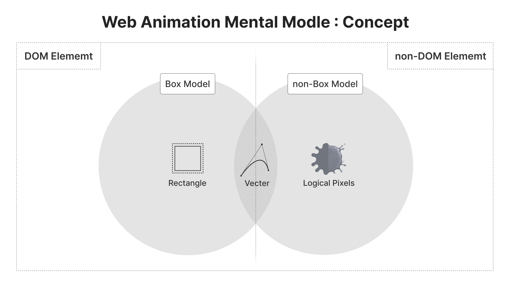
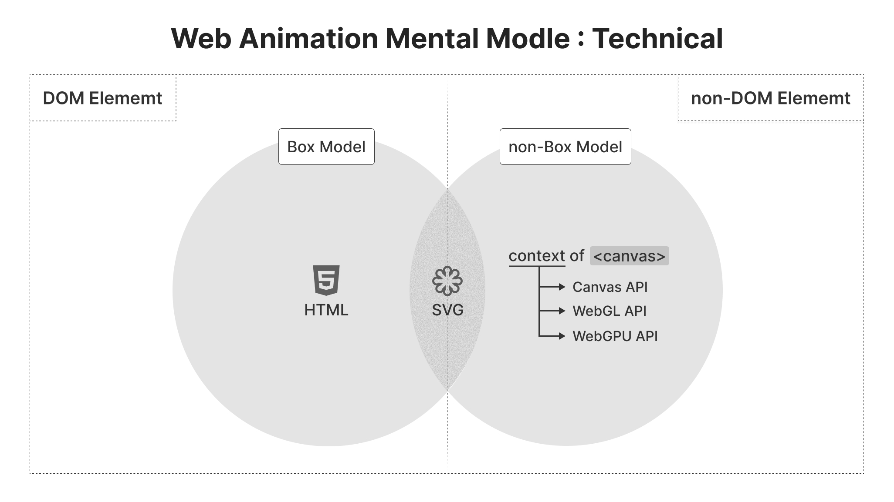
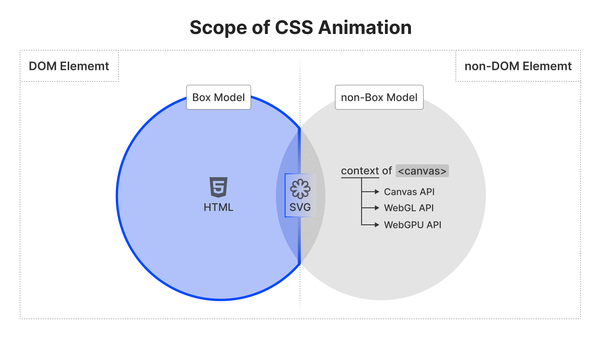
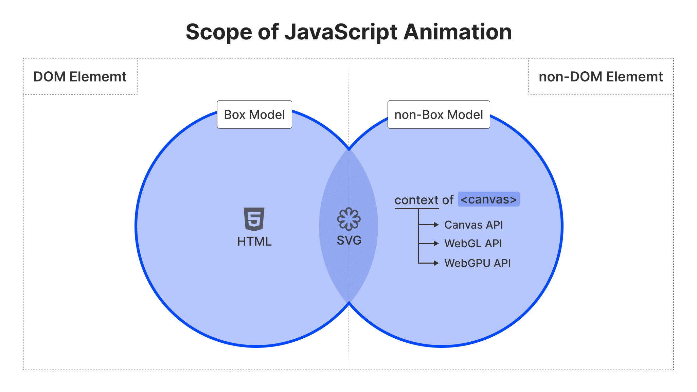
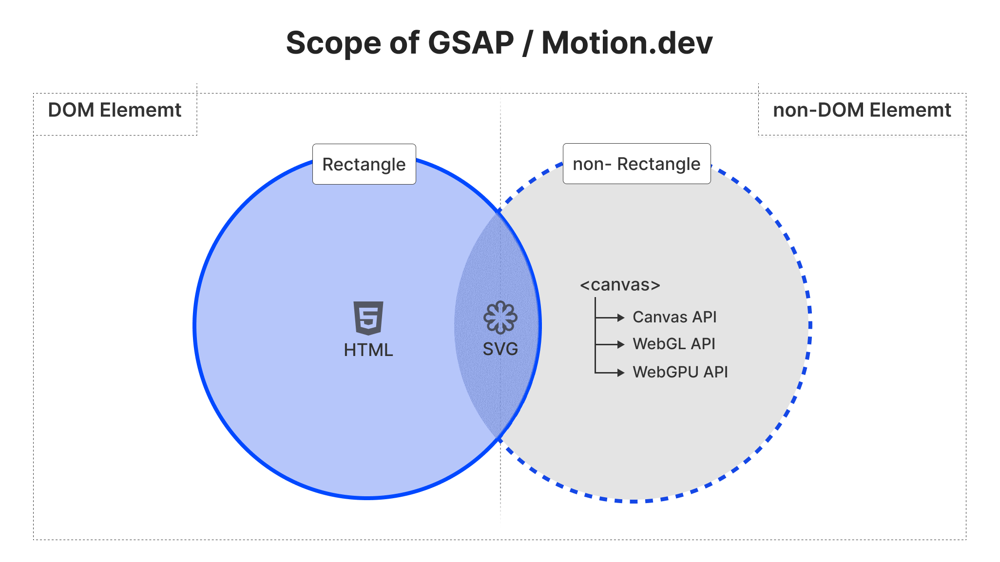
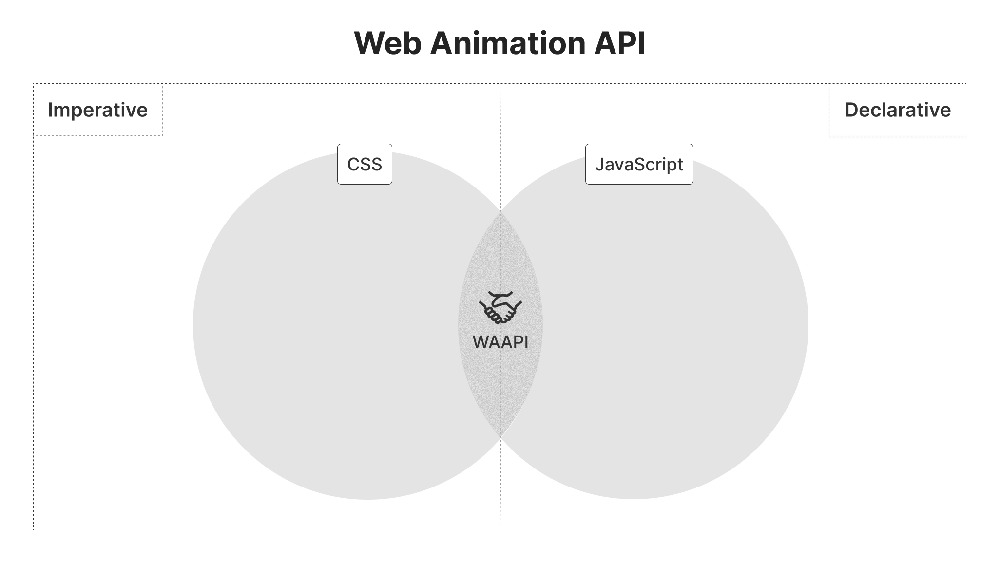
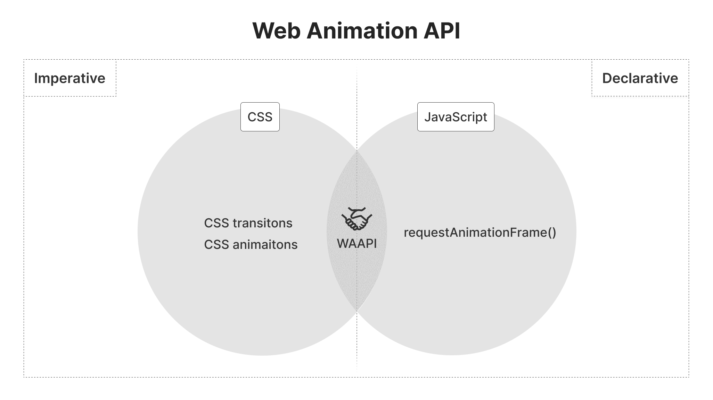
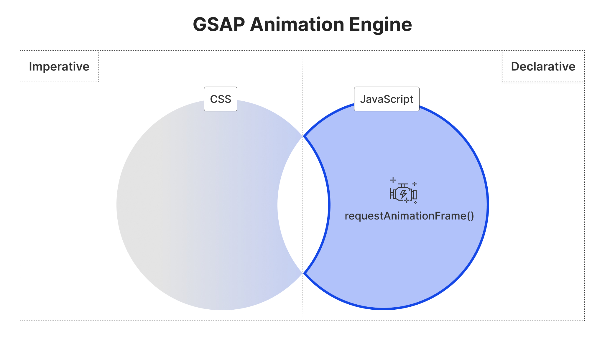
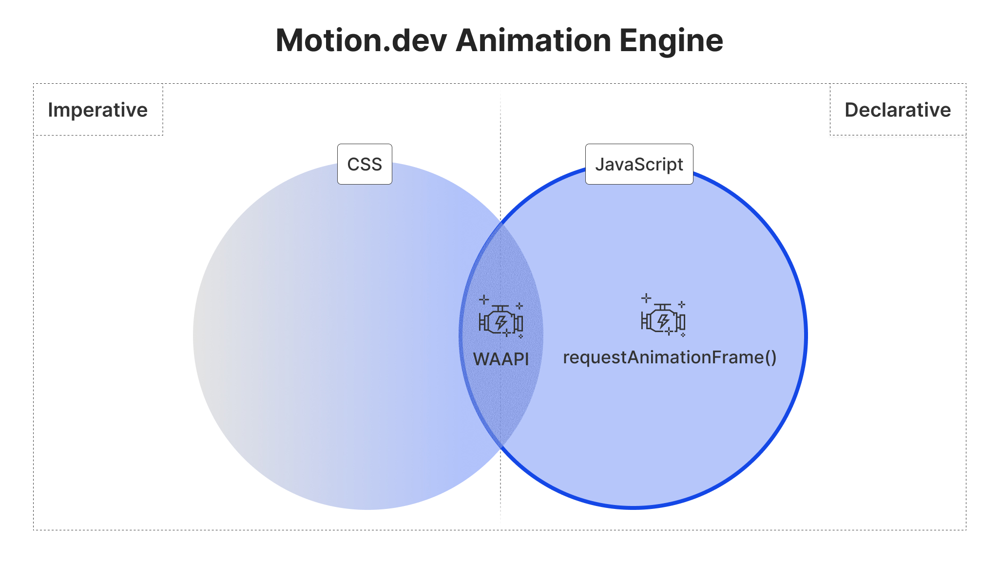

### はじめに

アニメーションを付け加えると、WebサイトやWebアプリケーションはより魅力的になります。アニメーションは、ユーザーに情報を効果的に伝えるだけでなく、ユーザーの注意を引くのにも役立ちます。アニメーションは、ユーザーが Web サイトやアプリケーションを使う際に、より楽しい体験を提供します。

アニメーションを実装する方法はいくつかありますが、JavaScript を使ったアニメーションライブラリを使用するのは一般的です。選択できる JavaScript ライブラリは非常に多く、どれがプロジェクトに適しているかを判断するのは難しい場合があります。

GSAP (GreenSock Animation Platform)

### Framer Motion と Motion One が合併して Motion が誕生

2024年12月11日、Framer Motion と Motion One が合併して Motion が誕生しました。詳しくは以下のリンクを参照してください。

https://motion.dev/blog/framer-motion-is-now-independent-introducing-motion

Framer Motion は、React を前提としたライブラリでしたが、Motion One は Vanilla JS や Vue などのフレームワークに依存しないライブラリとして作成されました。

これらが統一され、Motion Oneは Mot  ion に、Framer Motion は Motion for React になりました。

- Framer Motion
  React での使用を前提としたライブラリ
  宣言的な記述に重点が置かれている

- Motion One
  Vanilla JavaScript で記述されており、特定のフレームワークに依存しない。より汎用的で
  Web Animations API (WAAPI) 上に構築された小さなライブラリです。


Matt Perry は、Framer Motion の作成者であり、Motion にも関わっています。Motion は、Framer Motion と Motion One の統合により、React 以外のフレームワークでも使用できるようになりました。

Framer Motion の作成者である Matt Perry氏の Framer 社からの独立に伴い、Framer Motion は Motion として独立しました。

さらに、APIはGSAPのような伝統的なJavaScriptアニメーションライブラリに期待される多くの機能には欠けています。 例えば、スプリングのサポートや、トランスフォームを独立してアニメーションさせること、複雑なタイムラインのシーケンスなどはありません。 しかし、驚くような可能性も秘めている。 従来のJSアニメーションのバックボーンであるrequestAnimationFrameとは異なり、GPU上でアニメーションを実行することができます。

私は、WAAPIの荒削りな部分を滑らかにし、その機能を強化し、バンドルサイズを最小限に抑えるライブラリを正当化するだけの十分な利点があると感じました。 Motion Oneの設計目標は、WAAPIのjQueryになることです。 その結果、GSAPのようなライブラリと同じ機能セットの多くを実現し、場合によってはさらに進化させながら、15％近いバイト数で提供している。 しかし、WAAPIをベースにしているということは、WAAPIでは決してできないこともあるということです。特に、アニメーション・フレームごとに値にアクセスする機能です。 一度WAAPIのブラックボックスに入ってしまうと、アニメーションが終わるまで出てこない。 これは、値への直接アクセスが本質的なrequestAnimationFrameの裏返しです。


「Framer Motion か Motion One か」は、誤った二分法です。 Framer Motionは、宣言的で高レベルのAPIと、命令的で低レベルのAPIの両方を提供する。 一方、Motion One は後者のみを提供します。 両者は、異なるケースを持つ、異なる獣なのです。


https://motion.dev/


### Motion GSAP

GSAP が純粋に requestAnimationFrame (rAF) でアニメーションを実行するのに対し、Motion は独自のハイブリッドエンジンを持ち、rAF と Web Animations API (WAAPI) や ScrollTimeline のようなブラウザのネイティブ API の両方でアニメーションを実行できます。

https://motion.dev/docs/feature-comparison

### Framer Motion から独立し Motion へ

https://www.youtube.com/watch?v=gnPLkb8pP-g&ab_channel=LogRocket

Motionは、`mask-image` のようにブラウザでアニメーション化できないものも含め、あらゆるCSSのプロパティをアニメーションできます。具体的には以下をサポートしています。

1. 数字: `0` `100` など
2. 数字を含む文字列: `"0vh"`, `"10px"` など
3. 色: Hex, RGBA, HSLA.
4. 複数の数字や色を含む複雑な文字列 (`box-shadow`など)
5. `display: none/block`
6. `visibility: hidden/visible`


一般的な使用では、同じ値間 (つまり`"0px"`から`"100px"`) でのみアニメーションできます。ただし、`x` `y` `width` `height` `top` `left` `right` `bottom` は、例外として異なる値間でアニメーションできます。

```jsx title="Motion" caption="react"
<motion.div
  initial={{ x: "100%" }}
  animate={{ x: "calc(100vw - 50%)" }}
/>
```


CSS とは異なり、Motion ではすべての変換軸を個別にアニメーション化できます。

- translate: `x`, `y`, `z`
- scale: `scale`, `scaleX`, `scaleY`
- rotate: `rotate`, `rotateX`, `rotateY`, `rotateZ`
- skew: `skew` `skewX`, `skewY`
- 視点: `transformPerspective`


### 概念

#### 概念




#### 概念






#### 概念







