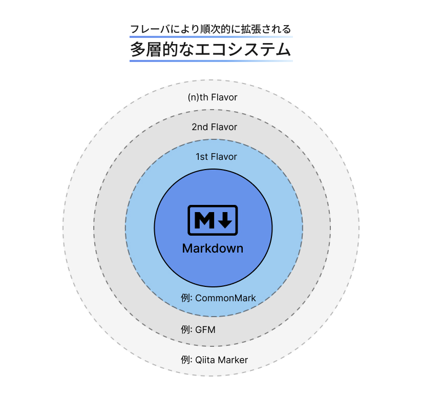

### はじめに

コンピューター
Web技術に関するBlog記事の執筆にあたって、参考文献として仕様書などに目を通す必要があります。

### Markdownの仕様の注意点

Markdownの言語仕様については、ドキュメントが乱立している状況です。混乱を避けるために、現在のMarkdownが使用されている様々な環境を考慮した、以下のオープンソースの参考ガイドを読むことをお勧めします。

https://www.markdownguide.org/

混乱の原因について、「Markdown Guide」では以下のように述べられています。


> <p lang="en">One of the most confusing aspects of using Markdown is that practically every Markdown application implements a slightly different version of Markdown. These variants of Markdown are commonly referred to as flavors.</p>
>
> <p lang="ja">Markdownを使用する上で最も混乱する点の1つは、実質的にすべてのMarkdownアプリケーションが、わずかに異なるバージョンのMarkdownを実装していることです。 これらのMarkdownのバリエーションは、一般的にフレーバーと呼ばれています。</p>
>
> @ 出典: Markdown Guide. <cite>["Flavors of Markdown"](https://www.markdownguide.org/getting-started/#flavors-of-markdown).</cite> Getting Started. (参照 2024-11-28)

つまり、混乱を避けるためには、現在使用しているMarkdownがどのフレーバーに基づいているかを理解する必要があります。


例えば、当サイトでは記事の執筆に GitHub Flavored Markdown（GFM）を使用しています。そのGFMは、CommonMarkに準拠しています。そしてCommonMarkは、Markdownに準拠しています。さっそく整理しましょう。




- #### Markdown&thinsp;とは？

  [Markdown](https://daringfireball.net/projects/markdown/)は、2004年に開発された軽量マークアップ言語です。シンプルで直感的な文法を持ち、プレーンテキストで書かれた内容をHTMLに変換することを目的としています。

  > <p lang="en">Markdown is a text-to-HTML conversion tool for web writers. Markdown allows you to write using an easy-to-read, easy-to-write plain text format, then convert it to structurally valid XHTML (or HTML).</p>
  >
  > <p lang="ja">MarkdownはウェブライターのためのテキストからHTMLへの変換ツールです。 Markdownを使えば、読みやすく、書きやすいプレーンテキスト形式を使って文章を書き、それを構造的に妥当なXHTML（またはHTML）に変換することができます。</p>
  >
  > @ 出典: Daring Fireball. <cite>["Introduction"](https://daringfireball.net/projects/markdown/).</cite> Markdown. (参照 2024-11-28)

  2004年12月17日が最終更新です。

- #### CommonMark&thinsp;とは？

  [CommonMark](https://spec.commonmark.org/)は、Markdownの仕様が一貫していなかったため、コミニティー主導によって作成された"実質的な標準仕様"です。これにより、Markdownの文法がより明確に定義され、異なる環境間での互換性が向上しました。CommonMarkは、より厳密なルールを持ち、Markdownの解釈における曖昧さを解消しています。

  > <p lang="en">John Gruber’s canonical description of Markdown’s syntax does not specify the syntax unambiguously.[...]This document attempts to specify Markdown syntax unambiguously.</p>
  >
  > <p lang="ja">John Gruber によるMarkdownの構文に関する標準的な説明では、構文が明確に指定されていません。[...]この文書では、Markdownの構文を一義的に指定することを試みます。</p>
  >
  > @ 出典: CommonMark. <cite>["Why is a spec needed?"](https://spec.commonmark.org/0.31.2/#what-is-markdown-).</cite> CommonMark Spec. (参照 2024-11-28)

- #### GitHub Flavored Markdown&thinsp;とは？

  [GitHub Flavored Markdown](https://github.github.com/gfm/)は、GitHubがMarkdownの基本仕様に独自の拡張を加えたものです。例えば、チェックリスト、テーブル、コードブロックのシンタックスハイライト、脚注など、GitHubリポジトリでの使用に特化した機能が追加されています。GFMはCommonMarkをベースにしているため、基本的な文法は共通していますが、GitHub独自の拡張が含まれています。

  > <p lang="en">This formal specification, based on the CommonMark Spec, defines the syntax and semantics of this dialect. GFM is a strict superset of CommonMark. All the features which [...] are not specified on the original CommonMark Spec are hence known as extensions, and highlighted as such.</p>
  >
  > <p lang="ja">この正式な仕様は、CommonMark 仕様に基づいて、この方言の構文とセマンティクスを定義します。GFM は、CommonMark の厳密なスーパーセットです。[...] 元の CommonMark 仕様で指定されていないすべての機能は拡張機能と呼ばれ、そのように強調表示されます。</p>
  >
  > @ 出典: GitHub. <cite>["What is GitHub Flavored Markdown?"](https://github.github.com/gfm/#what-is-github-flavored-markdown-).</cite> GitHub Flavored Markdown Spec. (参照 2024-11-28)

### GFMで引用を記述するには？

https://qiita.com/Yarakashi_Kikohshi/items/8b1ebfa798a35dec6154

#### blockquote 要素の意味論

> <p lang="en">The blockquote element represents a section that is quoted from another source. Content inside a blockquote must be quoted from another source, whose address, if it has one, may be cited in the cite attribute.</p>
>
> <p lang="ja">`blockquote`要素は、他のソースから引用されたセクションを表します。`blockquote`内の内容は、別のソースからの引用でなければならず、そのアドレスがあれば、`cite`属性で引用できます。</p>
>
> @ 出典: WHATWG. <cite>["The blockquote element"](https://html.spec.whatwg.org/multipage/grouping-content.html#the-blockquote-element).</cite> HTML Standard. (参照 2024-11-28)

仕様書によると、`<blockquote>`は別のソースから引用するべきだと強調されている。同一のソースからの引用はもちろんだが、装飾目的の使用も望ましくない。例えば、`<blockquote>`は`Google Chrome`だと以下のようなデフォルトのスタイルが付与されている。


```css title="user agent stylesheet"
blockquote {
  display: block;
  margin-block-start: 1em;
  margin-block-end: 1em;
  margin-inline-start: 40px;
  margin-inline-end: 40px;
  unicode-bidi: isolate;
}
```

{/* prettier-ignore */}
> <p lang="en">If the cite attribute is present, [...] User agents may allow users to follow such citation links, but they are primarily intended for private use (e.g., by server-side scripts collecting statistics about a site's use of quotations), not for readers.</p>
>
> <p lang="ja">`cite`属性が存在する場合、[...] ユーザ・エージェントは、ユーザがこのような引用リンクをたどることを許可するかもしれませんが、それは主に個人的な使用（例えば、サイトの引用の使用に関する統計を収集するサーバ側スクリプト）を意図したものであり、読者のためのものではありません。</p>
>
> @ 引用: <cite>HTML Standard [「4.4.4 The blockquote element」](https://html.spec.whatwg.org/multipage/grouping-content.html#the-blockquote-element)</cite>

https://developer.mozilla.org/ja/docs/Web/HTML/Element/blockquote

#### cite 要素の意味論

{/* prettier-ignore */}
> <p lang="en">The cite element represents the title of a work. [...] A person's name is not the title of a work — even if people call that person a piece of work — and the element must therefore not be used to mark up people's names.</p>
>
> <p lang="ja">`cite`要素は、著作物のタイトルを表します。[...] 人の名前は作品のタイトルではないので（たとえ人々がその人を作品と呼ぶとしても）、この要素は人の名前をマークアップするために使ってはいけません。</p>
>
> @ 引用: <cite>HTML Standard [「4.5.6 The cite element」](https://html.spec.whatwg.org/multipage/text-level-semantics.html#the-cite-element)</cite>

要するに「人=ヒト」と「物＝モノ」を区別しましょう

```html title="HTML"
<blockquote>
  <p>吾輩は猫である</p>
  <cite>福沢諭吉</cite>
</blockquote>
```

---

```html title="HTML"
<blockquote>
  <p>不倫は文化</p>
  <cite>石田純一</cite>
</blockquote>
```

### プラグインで機能拡張する

### `<blockquote>`

https://developer.mozilla.org/ja/docs/Web/HTML/Element/q

https://html.spec.whatwg.org/multipage/text-level-semantics.html#the-cite-element

<Playground_1/>

### Markdownへ適用するには？

69

https://github.com/NikitaRevenco/rehype-semantic-blockquotes

```mdx title="MDX"
> <p lang="en">The cite element represents the title of a work. [...] A person's name is not the title of a work — even if people call that person a piece of work — and the element must therefore not be used to mark up people's names.</p>
>
> <p lang="ja">`cite`要素は、著作物のタイトルを表します。... 人の名前は作品のタイトルではないので（たとえ人々がその人を作品と呼ぶとしても）、この要素は人の名前をマークアップするために使ってはいけません。</p>
>
> @ 引用: HTML Standard <cite>[「4.5.6 The cite element」](https://html.spec.whatwg.org/multipage/text-level-semantics.html#the-cite-element)</cite>
```

```html title="HTML"
<figure data-blockquote-container>
  <blockquote data-blockquote-content>
    <p lang="en">
      The cite element represents the title of a work. [...] A person's name is not the title of a work — even if people call that person a piece of work — and the element must therefore not be used to mark up people's names.
    </p>
    <p lang="ja">
      <code>cite</code>要素は、著作物のタイトルを表します。... 人の名前は作品のタイトルではないので（たとえ人々がその人を作品と呼ぶとしても）、この要素は人の名前をマークアップするために使ってはいけません。
    </p>
  </blockquote>
  <figcaption data-blockquote-credit>
    <p>
      引用: HTML Standard <cite><a href="https://html.spec.whatwg.org/multipage/text-level-semantics.html#the-cite-element" target="_blank" rel="noreferrer">「4.5.6 The cite element」</a></cite>
    </p>
  </figcaption>
</figure>
```

> <p lang="en">The cite element represents the title of a work. [...] A person's name is not the title of a work — even if people call that person a piece of work — and the element must therefore not be used to mark up people's names.</p>
>
> <p lang="ja">`cite`要素は、著作物のタイトルを表します。... 人の名前は作品のタイトルではないので（たとえ人々がその人を作品と呼ぶとしても）、この要素は人の名前をマークアップするために使ってはいけません。</p>
>
> @ 出典: <cite>[The cite element](https://html.spec.whatwg.org/multipage/text-level-semantics.html#the-cite-element),</cite> - HTML Standard : Text-level semantics. （参照 2024-11-28）

#### fontの追加設定

https://rsms.me/inter/#features/tnum

{/* ### 参照文献 */}

[^1]: My reference.
