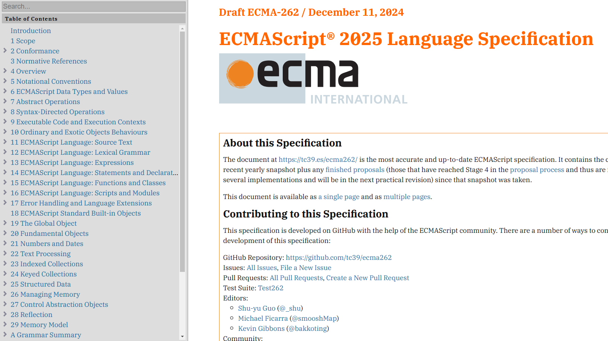

### 参照項

該当する機能やスタイルを実装するために、閲覧すべき参照項を以下に示す。

#### Library

- [velite](https://github.com/zce/velite)

#### Document

- [Velite - Docs](hhttps://velite.js.org/)
- [GitHub Flavored Markdown Spec](https://github.github.com/gfm/)
- [remark-gfm](https://github.com/remarkjs/remark-gfm)
- [micromark-extension-gfm](https://github.com/micromark/micromark-extension-gfm)
- [micromark-extension-gfm-footnote](https://github.com/micromark/micromark-extension-gfm-footnote)

#### Reference

- [基本的な書き方とフォーマットの構文](https://docs.github.com/ja/get-started/writing-on-github/getting-started-with-writing-and-formatting-on-github/basic-writing-and-formatting-syntax#footnotes)
- [MdxOptions](https://velite.js.org/reference/types#markdownoptions)

### 現状と課題
Markdown による脚注は、コンテンツ管理ライブラリの`velite`が内部的に`remark-gfm`を提供しているため、特に設定をしなくとも使用はできる。

注意点として [GitHub Flavored Markdown Spec](https://github.github.com/gfm/) の仕様書を参照しても、脚注に関する定義は一切なされていない。GitHub で使用できる Markdown は、[GitHub Flavored Markdown Spec](https://github.github.com/gfm/) を基盤として、さらに拡張機能を施しているとのこと。その一つが「脚注」らしく、挙動のズレがある。

#### 解決すべき問題

- [ ] 脚注に関する仕様の全体像を把握し、先回りしたスタイルの実装をする。

#### 理想の状態

### 表示例

https://developer.mozilla.org/ja/docs/Web/JavaScript

冒頭で「JavaScript (JS) は軽量でインタープリター型（あるいは実行時コンパイルされる）第一級関数を備えたプログラミング言語です。ウェブページでよく使用されるスクリプト言語として知られ、多くのブラウザー以外の環境、例えば Node.js や Apache CouchDB や Adobe Acrobat などでも使用されています。 JavaScript はプロトタイプベースで、マルチパラダイムで、シングルスレッドで、動的な言語であり、オブジェクト指向、命令型、宣言型（関数プログラミングなど）といったスタイルに対応しています。」[^1]と言及されています。

> 
JavaScript (JS) is a lightweight interpreted (or just-in-time compiled) programming language with first-class functions. While it is most well-known as the scripting language for Web pages, many non-browser environments also use it, such as Node.js, Apache CouchDB and Adobe Acrobat. JavaScript is a prototype-based, garbage-collected, dynamic language, supporting multiple paradigms such as imperative, functional, and object-oriented.

>
> 
JavaScript (JS) は、ファーストクラス関数を備えた軽量なインタープリタ型（またはジャストインタイムコンパイル型）プログラミング言語です。Webページのスクリプト言語として最もよく知られていますが、Node.js、Apache CouchDB、Adobe Acrobat など、ブラウザ以外の環境でも使用されています。JavaScript は、プロトタイプベース、ガベージコレクション、動的言語であり、命令型、関数型、オブジェクト指向など、複数のパラダイムをサポートしています。

>
> @ 出典: Mozilla. <cite>["JavaScript | MDN"](https://developer.mozilla.org/en-US/docs/Web/JavaScript).</cite> MDN Web Docs. (参照 2024-11-28)

[^2]

[ECMA（Ecma International）](https://ecma-international.org/)は、情報通信技術の標準化を目的とする非営利の標準化団体です。1961年に設立され、当初は「European Computer Manufacturers Association（欧州電子計算機工業会）」という名称でしたが、世界的な展開や活動状況を反映して1994年に現在の名称に変更されました。JavaScriptの国際規格であるECMAScriptを策定しています。

[^3]

[TC39](https://tc39.es/)は、JavaScriptの標準化を担当するECMAに所属する委員会です。ECMAScriptの開発と改良を行うために設立されました。このTC39が、ECMAScriptの新しい機能や仕様の変更を提案し、議論し、承認する役割を果たしています。

[^4]

[ECMA-262 ECMAScript（原文）](https://tc39.es/ecma262/)にて、執筆時点の最新の仕様を確認できます。

{/* 脚注 */}
[^1]: Mozilla. <cite>["JavaScript | MDN"](https://developer.mozilla.org/ja/docs/Web/JavaScript).</cite> MDN Web Docs. (参照 2024-11-28)
[^2]: Ecma International. <cite>["Home"](https://ecma-international.org/).</cite> Ecma International. (参照 2024-11-28)
[^3]: TC39. <cite>["TC39 - Specifying JavaScript"](https://tc39.es/).</cite> TC39. (参照 2024-11-28)
[^4]: TC39. <cite>["ECMAScript® 2025 Language Specification"](https://tc39.es/).</cite> ECMA-262. (2024-12-11). (参照 2024-11-28)
