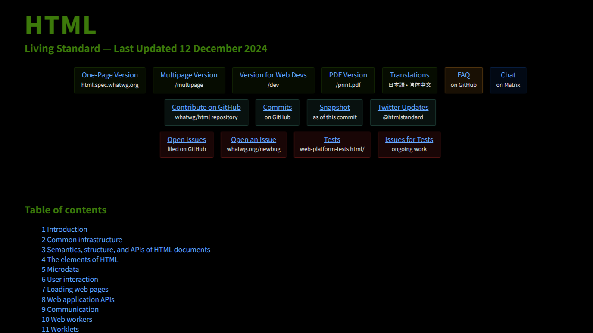

### はじめに

フロントエンドの開発に取り組む中で、疑問や課題が生じた際に「CSS 中央寄せ」などのキーワードで検索することがあると思います。すると高い確率で、<abbr title="Mozilla Developer Network">MDN</abbr> Web Docs の該当ページが検索結果の上位に表示されるはずです。

MDNは、初学者から上級者まで、世界中の開発者に広く利用されている非常に大規模なサイトです。Webの標準技術に関する膨大な情報を網羅的に提供しており、その簡潔で無駄のない説明や難解な専門用語の連続は、「公式感」を読む者に印象づけます。

そのため、初めてMDNを目にする初学者の多くは、「Webのすべてが記されている聖典」のように感じるかもしれません。少なくとも、私自身はそうでした。この理解は、まったくの見当違いというわけではありませんが、厳密には正確ではありません。

この記事では、MDNがあくまで**二次情報**であるという前提に立ち、フロントエンドの主要技術である HTML、CSS、JavaScript の一次情報（仕様書）はどこにあるのかを整理していきたいと思います。

### MDNは、圧倒的な公式感を漂わす「二次情報」である

プログラミングに取り組む際に、多くの時間が「コードを書くこと」よりも「適切なコードや情報を調べること」に費やされる傾向があります。これは、Web技術が非常に広範かつ急速に進化する分野であり、学習や実践の過程で常に新たな疑問や課題に直面することが避けられないためです。

物事を前に進めるためには、こうした疑問や課題を一つひとつ確実に解決していく必要があります。そのためには、信頼性の高い情報源から、解決に役立つ正確な情報を迅速に収集する力が重要です。特にWeb技術のように変化の激しい領域では、最新情報を適切に把握することが不可欠です。

書籍を参照するのも有効な手段ですが、情報の鮮度や収集効率の観点からは、インターネット検索を積極的に活用すべきです。近年では、大規模言語モデル（LLM）による回答生成も有力な選択肢となっています。ただし、ハルシネーション（事実に基づかない生成）の問題が依然として存在しており、必ずしも正確な情報が得られるとは限りません。特に、最新の動向を反映できていない場合もあります。

いずれの手段を用いるにしても、本質的な課題は「無数の情報の海」から信頼できる情報を見極めて、選び取ることにあります。そのための第一歩として、以下の記事が参考になります。

[https://stockmark.co.jp/coevo/primary-source](https://stockmark.co.jp/coevo/primary-source)

記事のまとめで「情報を上手く活用するためには、一次情報と二次情報の特徴を理解し、効率的に収集する必要がある」[^1]と言及されています。Web技術の文脈に沿って考えると、MDNは何次情報に該当するのか。MDNのトップページには、次のように記されています。

> 
Resources for Developers, by Developers. Documenting web technologies, including CSS, HTML, and JavaScript, since 2005.

>
> 
開発者による開発者向けリソース。2005年以来、CSS、HTML、JavaScriptなどのWebテクノロジーをドキュメント化しています。

>
> @ 出典: Mozilla. <cite>["MDN Web Docs"](https://developer.mozilla.org/ja/).</cite> MDN Web Docs. (参照 2024-11-28)

一般的には、一次情報を元にして分析、解釈、整理された情報が二次情報だと考えられています。二次情報は、しばしば一次情報を統合し、広い視点を提供したり結論を導き出します。そのような前提に立つと、「HTML、CSS、JavaScripなどのWebテクノロジー」が一次情報に該当し、それらを「ドキュメント化 ＝ 統合」していると読み取れます。つまり、MDNは**二次情報**に分類できます。

### 標準化団体という存在

「HTML、CSS、JavaScripなどのWebテクノロジー」が一次情報に該当するわけですが、それらは一体どこにあるのか？MDNを読み進めていくと、秘密結社のような雰囲気を漂わせる、謎めいた団体名が次々に登場します。<abbr title="Web Hypertext Application Technology Working Group">WHATWG</abbr>、<abbr title="World Wide Web Consortium">W3C</abbr>、<abbr title="ECMA International">ECMA</abbr>、IETF、IEEE、Unicode、OASIS、ISO、などなど…

これらは一般に、標準化団体（Standards Organization）と呼ばれ、それぞれが特定の分野における技術仕様を策定・公開しています。規格の公開形態には、国際規格として正式に発行されるもののほか、勧告（Recommendation）や推奨（Proposal）という形式で提供されるものもあります。

各団体の取り扱う分野は、プログラミング言語、ネットワーク通信、文字コードなど多岐にわたりますが、共通して追求している目的は明確です。それは、<strong>「Web技術の標準化によって、一貫性と互換性が高い開発環境」</strong>を開発者に提供することです。

MDN は、こうした標準化団体の活動と密接に関係しており、実際に記載されている多くの情報は、これらの団体が公開する仕様書をもとにしています。そして、その仕様書こそが一次情報です。

### 標準化団体と言語仕様

MDNに関連する標準化団体は数多くありますが、この記事では、フロントエンドにおける主要言語、HTML、CSS、JavaScriptに関連する団体に限定します。各標準化団体が策定する仕様書と言語の対応関係は、以下の通りです。

| 標準化団体 |        仕様書        |    言語    |
| ---------- | -------------------- | ---------- |
| W3C        | CSS Snapshot         | CSS        |
| WHATWG     | HTML Living Standard | HTML       |
| ECMA       | ECMA-262             | JavaScript |

#### CSS （ W3C ）

Home Page Screenshot[^2]
[^2]: W3C. <cite>["Making the Web work"](https://www.w3.org/).</cite> W3C. (参照 2024-11-28)

[W3C（World Wide Web Consortium）](https://www.w3.org/)は、Webで使用される各種技術の標準化を推進するために設立された非営利の標準化団体です。1994年に設立され、現在に至るまでWeb技術の標準化を牽引しています。W3Cは、業界の専門家や企業、研究者、そして一般のWebユーザーからのフィードバックを取り入れながら、継続的に技術標準を更新し、より良いWeb体験を提供するための努力を続けています。

[^3]
[^3]: CSS Working Group. <cite>["Cascading Style Sheets home page"](https://www.w3.org/2022/06/html-wg-charter.html).</cite> W3C. (参照 2024-11-28)

CSS（Cascading Style Sheets）の標準仕様もW3Cのワーキンググループである「[Cascading Style Sheets Working Group](https://www.w3.org/Style/CSS/)」によって策定されており、現在のバージョンに対応する「CSS Snapshot」として勧告されています。「CSS Snapshot」は、その時点で安定しているCSS仕様書を示し、開発者が最新かつ安定したスタイルを利用できるようにしています。

[^4]
[^4]: CSS Working Group. <cite>["CSS Snapshot 2023"](https://www.w3.org/2022/06/html-wg-charter.html).</cite> W3C. (2023-12-07). (参照 2024-11-28)

- [CSS Snapshot 2023（原文）](https://www.w3.org/TR/css-2023/)
- [CSS Snapshot 2023（日本語訳）](https://momdo.github.io/css-2023/)

<Callout title="そもそも CSS って誰が開発したの？">
ホーコン・ウィウム・リー（Håkon Wium Lie）は、World Wide Web（WWW）を考案し、ハイパーテキストシステムを実装・開発した人物である。またURL、HTTP、HTML の最初の設計は彼によるものである。

https://www.youtube.com/watch?v=LeC26IO1WV8&t=1625s
</Callout>

#### HTML （ WHATWG ）

[^5]
[^5]: WHATWG. <cite>["Welcome to the WHATWG community"](https://whatwg.org/).</cite> WHATWG. (参照 2024-11-28)

[WHATWG（Web Hypertext Application Technology Working Group）](https://whatwg.org/)は、HTMLと関連技術の開発をするための非営利の標準化団体です。前述のW3CがWeb開発者の要望を軽視していることなどを不満に思ったApple、Mozilla、Operaの開発者たちによって2004年に結成されました。HTMLの標準仕様である「HTML Living Standard」を策定しています。

<Callout type="warning" title="W3C勧告の「HTML5」は廃止済み">
こちらの記事▸「[HTML Living StandardとHTMLの歴史](https://www.tohoho-web.com/html/memo/htmlls.htm#w3c_to_whatwg)」で、W3Cが勧告する「HTML5」が廃止され、WHATWGが策定する<strong>「HTML Living Standard」が参照すべき唯一の標準仕様</strong>となった経緯についてまとめられています。「HTML5」が廃止されたとはいえ、[HTML Working Group](https://www.w3.org/groups/wg/css/)がW3Cにまだ存在します。[憲章](https://www.w3.org/2022/06/html-wg-charter.html)を読む限りだと、WHATWGと部分的な協力関係にあり一部の仕様に提言ができるようですが、特に参照する必要はなさそうです。
</Callout>

[^6]
[^6]: WHATWG. <cite>["HTML Standard"](https://html.spec.whatwg.org/multipage/).</cite> HTML Living Standard. (2024-12-12). (参照 2024-11-28)

- [HTML Living Standard（原文）](https://html.spec.whatwg.org/multipage/)
- [HTML Living Standard（日本語訳）](https://momdo.github.io/html/)

<Callout title="そもそも HTML って誰が開発したの？">
ティム・バーナーズ=リー（Tim Berners-Lee）は、World Wide Web（WWW）を考案し、ハイパーテキストシステムを実装・開発した人物である。またURL、HTTP、HTML の最初の設計は彼によるものである。

https://www.youtube.com/watch?v=GUrDI6OkJfU
</Callout>

#### JavaScript （ ECMA ）

[^7]
[^7]: Ecma International. <cite>["Home"](https://ecma-international.org/).</cite> Ecma International. (参照 2024-11-28)

{/* > 
>
> @ 出典: Ecma International. <cite>["Home"](https://ecma-international.org/).</cite> Ecma International. (参照 2024-11-28) */}

[ECMA（Ecma International）](https://ecma-international.org/)は、情報通信技術の標準化を目的とする非営利の標準化団体です。1961年に設立され、当初は「European Computer Manufacturers Association（欧州電子計算機工業会）」という名称でしたが、世界的な展開や活動状況を反映して1994年に現在の名称に変更されました。JavaScriptの国際規格であるECMAScriptを策定しています。

<Callout title="ECMAScriptってなに？">
ECMAScriptは標準仕様であり、JavaScriptはその仕様に従って実装されたプログラミング言語です。こちらの記事▸「[JavaScriptとECMAScriptの関係](https://typescriptbook.jp/overview/ecmascript)」で、ECMAScriptが誕生した経緯について解説されています。
</Callout>

[^8]
[^8]: TC39. <cite>["TC39 - Specifying JavaScript"](https://tc39.es/).</cite> TC39. (参照 2024-11-28)

{/* > 
>
> @ 出典: TC39. <cite>["TC39 - Specifying JavaScript."](https://tc39.es/).</cite> TC39. (参照 2024-11-28) */}

[TC39](https://tc39.es/)は、JavaScriptの標準化を担当するECMAに所属する委員会です。ECMAScriptの開発と改良を行うために設立されました。このTC39が、ECMAScriptの新しい機能や仕様の変更を提案し、議論し、承認する役割を果たしています。

[^9]
[^9]: TC39. <cite>["ECMAScript® 2025 Language Specification"](https://tc39.es/).</cite> ECMA-262. (2024-12-11). (参照 2024-11-28)

{/* > 
>
> @ 出典: TC39. <cite>["ECMAScript® 2025 Language Specification"](https://tc39.es/).</cite> ECMA-262. (2024-12-11). (参照 2024-11-28) */}

[ECMA-262 ECMAScript（原文）](https://tc39.es/ecma262/)にて、執筆時点の最新の仕様を確認できます。

<Callout title="そもそも JavaScript って誰が開発したの？">
ブレンダン・アイク（Brendan Eich）は、World Wide Web（WWW）を考案し、ハイパーテキストシステムを実装・開発した人物である。またURL、HTTP、HTML の最初の設計は彼によるものである。1995年に10日間で開発された。

https://www.youtube.com/watch?v=qKJP93dWn40
</Callout>

### MDNの存在意義

このように、MDNのようなドキュメントサイトは、Web開発者が効率的に学び、最新の情報にアクセスできるようにするための重要なリソースです。これからWeb開発を始める人にとっても、非常に有益なツールと言えるでしょう。

MDN（Mozilla Developer Network）は、非常に信頼性の高く、Web開発に関する多くの情報を提供しています。ただし、MDNは一次情報ではなく、二次情報に分類されます。これは、MDNが元となる、わかりやすく説明するためのドキュメントを提供しているためです。

1. 一元的な情報提供
MDNのようなドキュメントサイトは、HTML、CSS、JavaScript、APIなど、Web開発に必要な情報を一元的に提供しています。これにより、**開発者は複数の情報源を探し回る必要がなくなります。**

2. 信頼性と最新情報の提供
MDNはMozillaが運営しており、提供される情報は信頼性が高く、最新のWeb標準やブラウザの機能に対応しています。これにより、開発者は最新の技術を安心して使用できます。

3. 教育リソース
MDNは、初心者から上級者までを対象とした豊富なチュートリアルやガイド、リファレンスを提供しています。これにより、さまざまなレベルの開発者が自分のスキルを向上させることができます。

4. コミュニティのサポート
MDNは開発者コミュニティによって支えられており、フィードバックやコントリビューションを受け入れることで、常に情報を更新しています。これにより、実際の開発現場で役立つ知識が反映されています。

5. 多言語対応
MDNは複数の言語でコンテンツを提供しており、世界中の開発者が母国語で学習できるようになっています。

### アクセシビリティはデジタル庁を参考に

デジタル庁

[ウェブアクセシビリティ導入ガイドブック](https://www.digital.go.jp/resources/introduction-to-web-accessibility-guidebook)

[JIS X 8341-3](https://webdesk.jsa.or.jp/books/W11M0090/index/?bunsyo_id=JIS+X+8341-3%3A2016)

[ISO/IEC 40500](https://webdesk.jsa.or.jp/books/W11M0090/index/?bunsyo_id=JIS+X+8341-3%3A2016)

デジタル庁デザインシステムが参照しているアクセシビリティの基準は、WCAGやWAI-ARIAといったアクセシビリティに関する国際的な勧告と、常にアップデートされているHTMLの標準仕様（HTML Living Standard）です。WCAGの最新バージョンは2.2で、2.0はJIS X 8341-3:2016と互換性があります。

<dfn><abbr title="World Wide Web Consortium">W3C</abbr></dfn>
W3C（World Wide Web Consortium）

[W3C](https://www.w3.org/)

[Web Accessibility Initiative (WAI) | W3C](https://www.w3.org/WAI/)
[W3C Accessibility Standards Overview | Web Accessibility Initiative (WAI) | W3C](https://www.w3.org/WAI/standards-guidelines/)

<dfn><abbr title="Web Content Accessibility Guidelines">WCAG</abbr> 2.2</dfn>

[WCAG 2.2（原文）](https://www.w3.org/TR/WCAG22/)
[WCAG 2.2（日本語訳）](https://waic.jp/translations/WCAG22/)

[WCAG 3.0（原文）](https://www.w3.org/TR/wcag-3.0/)

<dfn><abbr title="Accessible Rich Internet Applications">WAI-ARIA</abbr> 1.2</dfn>

[WAI-ARIA（原文）](https://www.w3.org/TR/wai-aria-1.2/)
[WAI-ARIA（日本語訳）](https://momdo.github.io/wai-aria-1.2/)

<dfn><abbr title="Web Accessibility Infrastructure Committee">WAIC</abbr></dfn> （ウェブアクセシビリティ基盤委員会）
[ウェブアクセシビリティ基盤委員会](https://waic.jp/)

{/* 脚注 */}
[^1]: WHATWG. <cite>["The blockquote element"](https://html.spec.whatwg.org/multipage/grouping-content.html#the-blockquote-element).</cite> HTML Standard. (参照 2024-11-28)
