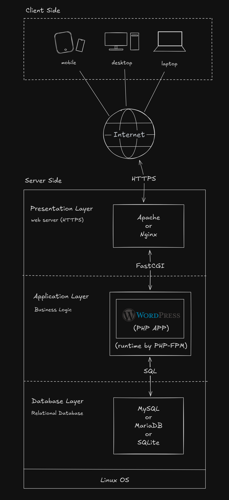

### はじめに
WordPressは、世界で最も広く使用されているCMSであり、「個人的で小規模なブログサイト」から「企業による大規模なECサイト」まで、さまざまなウェブサイトの構築に利用されている。以下の技術群を実行基盤の要件とし、GNU General Public License（GPL）の下で配布されているオープンソースのソフトウェアである。

- PHP version 8.3 or greater.
- MySQL version 8.0 or greater OR MariaDB version 10.6 or greater.
- HTTPS support

<Callout title="CMSとは？">
<dfn><abbr>CMS</abbr></dfn>は、content management system の略称である。「コンテンツ管理システム」とも呼ばれる。ウェブコンテンツを構成するテキストや画像などのデジタルコンテンツを統合・体系的に管理し、配信など必要な処理を行うシステムの総称である。2005年頃より一般的に定着したといわれ、2003年に登場したWordPressは、その普及に大きく貢献している。
</Callout>

近年は、WordPressの代替となりうるノーコードツールや、Headless CMS を活用したJamstack開発など、新しい選択肢が増えている。とはいえ、全世界のウェブサイトの40%以上でWordPressが導入されているとの統計結果もあり、依然として多くのユーザーに利用されている。

とくに、web制作の文脈においては、WordPressの基本的な仕組みや開発手法を理解しておくことは、今後も重要なスキルであり続けると推測される。本稿では、本格的な学習に至る前段階として、参照すべき公式ドキュメントの把握や、WordPressを取り巻くエコシステムの情報を整理する。筆者自身もWordpress未学者なため、技術的な詳細については、立ち入らない。

### WordPress の公式サイトは二つあるの？

WordPressに関する疑問として、まず解決するべきことは「公式サイトはどこにある？」のという問題である。Googleなどの検索エンジンで調べると、トップレベルドメインだけが異なる二つのサイトが存在し、ページの外観も似ているため、混乱する人が多いのではないだろうか。

- [Wordpress.org](https://ja.wordpress.org/)
- [Wordpress.com](https://wordpress.com/)

結論から言うと、公式として参照すべきは WordPress.org である。ここは2003年に Matt Mullenweg と Mike Little が立ち上げたオープンソースのソフトウェア「WordPress」を配布する場所であり、非営利団体である WordPress Foundation が商標を管理している。自分でサーバーを借りてインストールし、自由に構築できるのが特徴で、実務においてもこちらを指すことが大半ではないだろうか。

一方の WordPress.com は、2005年に創始者の Mullenweg が設立した Automattic社 が運営する商用ホスティングサービスである。WordPressを基盤にしているが、自由度は選択プランに依存し、公式プロジェクトそのものではない。つまり「レシピ本としての WordPress.org」と「そのレシピを利用したレストランチェーンとしての WordPress.com」という関係である。

創始者が両方に関わっているため「WordPress.com が公式」と誤解されやすいが、オープンソース本体の正規の拠点は WordPress.org である。両者の違いについては、以下の公式サイトの回答が参考になる。

https://wordpress.org/documentation/article/difference-between-wordpress-org-and-wordpress-com/

### 公式ドキュメント

WordPress を本格的に学ぶ際には、WordPress.org が提供している公式ドキュメントを参照することが基本である。検索するとさまざまな情報が見つかるが、古い記事や誤った情報も混在しているため、まずは公式の情報源を基盤に据えることが重要である。

#### 開発者向け（日本語）

日本語のドキュメントは、有志の方々によって英語版が翻訳され、ハンドブックとして公開されている。基礎的な理解を得る上では有用だが、WordPressにおける重要事項に限定された部分翻訳である。情報の網羅性を確保したい場合や、最新情報を扱う際には注意が必要である。

https://ja.wordpress.org/team/handbook/

#### 開発者向け（英語）

最も信頼できるのは、やはり英語版のドキュメントである。こちらは常に最新仕様に対応して更新されており、網羅的である。日本語版のフォールバックとして、必要に応じて参照することが望ましい。

https://developer.wordpress.org/

#### 副読本

さらに理解を深めるためには、最新の教本や参考書を副読することが望ましい。WordPress は 5.9 以降で フルサイト編集 (Full Site Editing: FSE) が導入され、テーマの構造やサイト構築のアプローチが従来の「クラシックテーマ」とは大きく変わった。

クラシックエディター
ブロックエディター（Gutenberg）

ReactによるSPA

ウェブ上で確認できる編集画面を、従来のクラシックエディターよりも、ユーザーが直感的に操作できる

HTMLを独自拡張している。具体的にはコメント機能にWordPressが独自に定義したタグを利用している。

二重管理されている。

PHPによるMPA

> 
The Block Editor is the result of the work done on the Gutenberg project, which aims to revolutionize the WordPress editing experience.

>
> 
ブロックエディターは、WordPressの編集体験を一新することを目指して進められてきた Gutenberg プロジェクトの成果です。

>
> @ 出典: WHATWG. <cite>["The blockquote element"](https://html.spec.whatwg.org/multipage/grouping-content.html#the-blockquote-element).</cite> HTML Standard. (参照 2024-11-28)

### チュートリアル

#### 初心者向け
https://learn.wordpress.org/course/beginner-wordpress-developer/

#### 中級者向け
https://learn.wordpress.org/course/intermediate-theme-developer/

#### Udemy
https://www.udemy.com/topic/wordpress/

### 開発環境の構築方法

WordPress のローカル開発環境の構築は、開発者に寄り添っていろいろな方法が提供されている。2025年現在においては、Dockerによるコンテナ仮想技術を基盤とし、ふたつのアプローチが推奨されている。

まずは、エコシステムが提供するWordPress専用の開発環境を提供するデスクトップアプリケーションを活用する方法である。コミュニティでよく言及されているのは

- [Studio by WP-Engine](https://developer.wordpress.com/ja/studio/)
- [Local by WordPress.com](https://localwp.com/)

どちらもDockerが内部で統合されており、開発者は、Dockerに関する専門知識がなくとも、GUIベースで簡単に開発環境を構築できる。

- [wp-env](https://developer.wordpress.org/block-editor/getting-started/devenv/get-started-with-wp-env/)

### 参照すべき仕様書

WordPressサイトの構築、特にテーマやプラグインの独自開発を行う際に、コードの品質、保守性、セキュリティ、そしてWordPress本体との互換性を担保するためには、公式の仕様書や開発者向けドキュメントを参照することが不可欠です。以下に、WordPress構築において参照すべき主要な仕様書・ドキュメントを目的別に整理して

developer.wordpress.orgは、WordPressの公式開発者向けドキュメントであり、主に英語で書かれた正規の仕様書として機能します。一方、ja.wordpress.org/team/handbook/は、WordPress日本語コミュニティが独自に運営しているハンドブックです。

この2つのサイトの関係性は以下の通りです。

- [WordPress.org - Document](https://wordpress.org/documentation/)

WordPressコアチームによって維持管理される、開発者向けの一次情報源です。APIリファレンス、コード例、開発ガイドなど、公式な技術情報が掲載されています。世界中のWordPress開発者が参照する、最も信頼できるドキュメントです。

- [WordPress.org - Document](https://ja.wordpress.org/team/handbook/)

これはja.wordpress.org（日本語版サイト）の一部で、日本語版のボランティアチームが作成・管理しています。developer.wordpress.orgのドキュメントの翻訳版や、日本語コミュニティ独自のコンテンツ（ローカライゼーションに関するガイド、コミュニティ活動の記録など）が含まれています。URL構造が異なるのは、公式ドキュメントとは別の、コミュニティが作成するハンドブックであるためです。

| Command | Description |
| --- | --- |
| [必須要件](https://ja.wordpress.org/about/requirements/) | WordPressを動作させるために必要なサーバー環境（PHP、MySQL/MariaDBの推奨バージョンなど）が明記されています。 サーバー選定時や環境構築の最初に必ず確認してください。 |
| [GNU](https://ja.wordpress.org/about/requirements/) | WordPressはGPLライセンスで提供されています。テーマやプラグインを配布・販売する際には、このライセンスを正しく理解しておく必要があります。 |

| Command | Description |
| --- | --- |
| [必須要件](https://ja.wordpress.org/about/requirements/) | WordPressを動作させるために必要なサーバー環境（PHP、MySQL/MariaDBの推奨バージョンなど）が明記されています。 サーバー選定時や環境構築の最初に必ず確認してください。 |
| [GNU](https://ja.wordpress.org/about/requirements/) | WordPressはGPLライセンスで提供されています。テーマやプラグインを配布・販売する際には、このライセンスを正しく理解しておく必要があります。 |

### 副読すべき教本

公式ドキュメントは、あくまで仕様書であり、簡素な説明が多い。決して読みづらいわけではないが、初心者にとっては、理解の助けとなる参考書があると心強い。
日本国内におけるWordPress分厚い出版文化に支えられている界隈においては、良書が多く出版されている。以下に、いくつかの参考書を挙げる。

https://wp-exp.com/blog/wordpress-book-osusume/

### 設計のパラダイムシフト

WordPressは、2020年代に入ってから大きな設計のパラダイムシフトを経験している。従来の「クラシックテーマ」に加えて、2021年にリリースされたWordPress 5.9で「フルサイト編集 (Full Site Editing: FSE)」が導入され、テーマの構造やサイト構築のアプローチが大きく変わった。

従来の「テーマ階層を理解してテンプレートファイルを組み合わせる」流れに加えて、ブロックエディターとブロックテーマを中心に据えた設計思想が導入されており、この変化を体系的に理解するには 新しい観点から書かれた教材が不可欠である。
